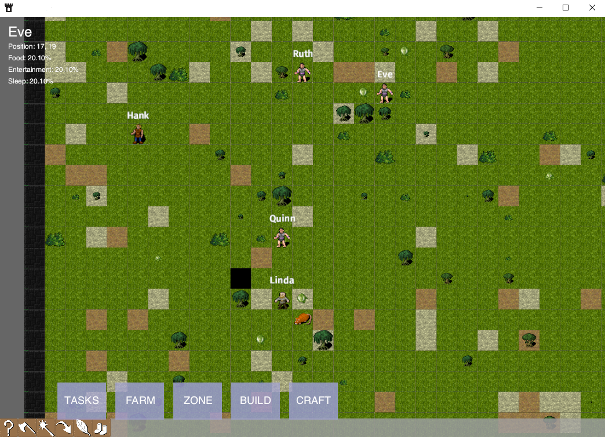

# COLONY

COLONY is a Rust game, built with Bevy, that plays like any other colony simulator game. The current version is very basic, there are basic food items that your units can consume, your units have basic stats like hunger, and there is some basic map generation.

What are the various systems?
* "Seasons" represents the movement of time, and causes plants to grow and die.
* "Movetoward" is an A* algorithm that lets objects move in the most direct path, avoiding obstacles along the way.
* Spacebar will pause the game
* Escape will close the game
* Some of the menus don't work yet, but you can farm cabbages and trees, and a unit will go plant these
* Now you can build walls
* Crafting is not yet implemented
* There is a monster spawner
* You can give Orders > Chop to chop down trees
* Units automatically sleep when they're tired.



## Things Needed For Alpha Release

1. Improve the UI box when you click one of your units, displaying their personality, attributes, and health
2. (Easy) Implementing more variety in already-implemented systems: foods, trees, and plants.
3. Biomes should exist in patches across a larger map. Biomes could also represent areas, like a graveyard type area could be a "Biome".
4. Implement construction skills.
5. Add more kinds of objects
6. Better organize tileset file.
7. Implement weapons/equipment/inventory.
8. Giving orders to units.
9. Implement the effects of more personality traits.

## Getting Started

Generally ```cargo build``` and then ```cargo run``` works fine on Windows 11 and Ubuntu.

## Contributing

Please see the [CONTRIBUTING.md](CONTRIBUTING.md) file for guidelines on how to contribute to this project.

## License

This project is licensed dually under the MIT License and Apache 2.0 License - see the [LICENSE](LICENSE) file for details.

## Art

The art may fall under different licensing conditions. Please see the specific licenses regarding any artwork.

Main tailset is from https://opengameart.org/content/dungeon-crawl-32x32-tiles and it is shown as CC-0.

## Contribution License

By contributing to this project, you agree to license your contributions under the terms of the MIT license and the Apache 2.0 license. Additionally, you grant the project owner, Ryan Kopf, an unlimited, irrevocable, perpetual, universe-wide license to use your contributions for any purpose, including but not limited to commercial purposes, without any additional restrictions or obligations.
